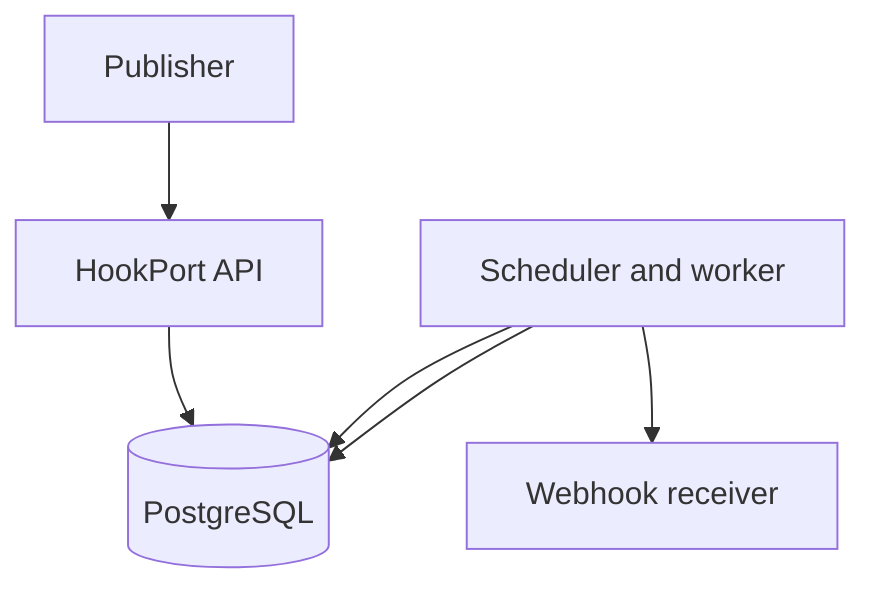

# HookPort

HookPort accepts events and delivers them as signed HTTP webhooks to registered endpoints. It stores delivery attempts in PostgreSQL, retries temporary failures, recovers stalled work, and lets an operator replay failed deliveries.

## How it works



Publishing stores an event and a pending delivery. A scheduled worker claims due deliveries in a short database transaction, then sends the HTTP request outside that transaction. It records the result and either finishes or schedules another attempt. Concurrent workers use PostgreSQL row locking with `SKIP LOCKED`; deliveries stuck in progress can be recovered. Delivery is **at least once**: a receiver should make processing idempotent using the event ID.

Each endpoint has a PostgreSQL-backed token bucket. It starts with a capacity of 5 tokens and refills at 5 tokens per second unless configured otherwise. Claiming a delivery spends one token. When none is available, the delivery waits without an HTTP request, attempt record, or retry-budget charge. The bucket limits **claims**, not the exact spacing of completed HTTP sends. A committed claim spends its token even if the worker crashes before sending.

## Run locally

Requirements: Docker with Compose. From the project root:

```bash
docker compose up --build
```

In another terminal:

```bash
curl -i http://localhost:8080/actuator/health
```

The expected health status is `UP`. Compose starts PostgreSQL, waits for its health check, and starts HookPort; Flyway applies database migrations during application startup. Stop with `Ctrl+C` or `docker compose down`. The named PostgreSQL volume persists across normal restarts. Keep local passwords in `.env`, outside Git. Never use `docker compose down -v` unless you intend to delete local database data.

## API walkthrough

These examples use Google as an intentionally unsuccessful receiver. It has a public address that passes endpoint URL validation, but it is not a webhook receiver. The response code it returns may change. Use an endpoint you control to demonstrate successful delivery.

### 1. Register an endpoint

```bash
curl -i -X POST http://localhost:8080/api/v1/endpoints \
  -H 'Content-Type: application/json' \
  -d '{
    "name": "google-demo",
    "targetUrl": "https://google.com",
    "bucketCapacity": 5,
    "refillPerSecond": 5
  }'
```

Copy the `id` from the response:

```bash
ENDPOINT_ID=PASTE_ENDPOINT_ID_HERE
```

Registration checks whether the URL is allowed; it does not guarantee that the destination accepts a webhook. The endpoint creation response also returns an `ETag` for conditional updates. Keep any returned signing secret private.

### 2. Publish an event

```bash
curl -i -X POST \
  "http://localhost:8080/api/v1/endpoints/$ENDPOINT_ID/events" \
  -H 'Content-Type: application/json' \
  -H 'Idempotency-Key: readme-demo-001' \
  -d '{
    "eventType": "demo.created",
    "payload": {
      "message": "Hello from HookPort"
    }
  }'
```

Copy the `deliveryId` from the response:

```bash
DELIVERY_ID=PASTE_DELIVERY_ID_HERE
```

The scheduler processes the pending delivery automatically. Use a fresh idempotency key for a new event; reusing a key is intended to prevent duplicate publication.

### 3. Inspect the delivery

```bash
curl -i "http://localhost:8080/api/v1/deliveries/$DELIVERY_ID"
```

The response includes the status, attempt count, and next retry time when applicable. A permanent failure typically becomes `FAILED` after one attempt.

### 4. Inspect HTTP attempts

```bash
curl -i \
  "http://localhost:8080/api/v1/deliveries/$DELIVERY_ID/attempts?page=0&size=20"
```

Attempt history includes outcome, HTTP status when available, duration, and error details.

### 5. List an endpoint's deliveries

```bash
curl -i \
  "http://localhost:8080/api/v1/endpoints/$ENDPOINT_ID/deliveries?page=0&size=20"
```

Pages are zero indexed. The query API limits page size to 100.

### 6. Replay a failed delivery

```bash
curl -i -X POST \
  "http://localhost:8080/api/v1/deliveries/$DELIVERY_ID/replay"
```

Copy `replayDeliveryId` from the response:

```bash
REPLAY_DELIVERY_ID=PASTE_REPLAY_DELIVERY_ID_HERE
curl -i "http://localhost:8080/api/v1/deliveries/$REPLAY_DELIVERY_ID"
```

Replay creates a **new** pending delivery for the original event, with a fresh attempt count. The original delivery and its attempt history remain available. The scheduler can process the replay immediately after the API returns. Replay is allowed for failed or exhausted deliveries while their endpoint is active.

## Delivery states

| State | Meaning |
| --- | --- |
| `PENDING` | Waiting for its first attempt |
| `IN_PROGRESS` | Claimed for an HTTP attempt |
| `RETRY_SCHEDULED` | Waiting for another attempt after a temporary failure |
| `DELIVERED` | Receiver accepted the request |
| `FAILED` | Permanent failure |
| `EXHAUSTED` | Retry limit reached |

Success responses complete the delivery. Client errors such as `400` and `404` are permanent failures; `429`, server errors, timeouts, and network failures are retryable until the configured attempt limit. Retry delays increase with jitter. Each HTTP attempt has its own history record. An original delivery and its replay share an event ID but have different delivery IDs.

## Webhook security

HookPort signs the **exact bytes** sent in the request using HMAC-SHA256 and the endpoint's signing secret. The receiver gets `X-HookPort-Event-Id`, `X-HookPort-Event-Type`, `X-HookPort-Timestamp`, and `X-HookPort-Signature`. The secret is never sent with the request. A receiver should reject stale timestamps, calculate HMAC over `timestamp + "." + raw body bytes`, compare signatures in constant time, and atomically deduplicate processed event IDs alongside its business changes. The development receiver prints headers; it does not verify signatures.

HookPort checks target URLs during registration and before delivery to reduce server-side request forgery. Normal configuration rejects private and reserved targets; development configuration permits local targets for testing. Redirects must not be followed to an unchecked destination. URL validation alone leaves a DNS time-of-check/time-of-use gap if the HTTP client resolves the hostname again. Before exposing HookPort to untrusted users, enforce outbound network restrictions or connect to a validated address while preserving hostname and TLS verification.

## Operations and current work

`/actuator/health` reports application health. Actuator and Prometheus expose delivery metrics; logs include correlation and delivery identifiers without payloads or signing secrets. Restrict access to operational endpoints in any public deployment.

The end-to-end HTTP test suite and GitHub Actions CI were intentionally deferred. Deployment and release tagging are also pending. A green local startup does not substitute for these release checks.

## Implementation topics

Spring Boot, Spring Data JPA, PostgreSQL, Flyway, Testcontainers, scheduling, optimistic locking and ETags, database-backed claiming, retries and recovery, HMAC signatures, SSRF controls, Actuator, Micrometer, and Docker Compose.
